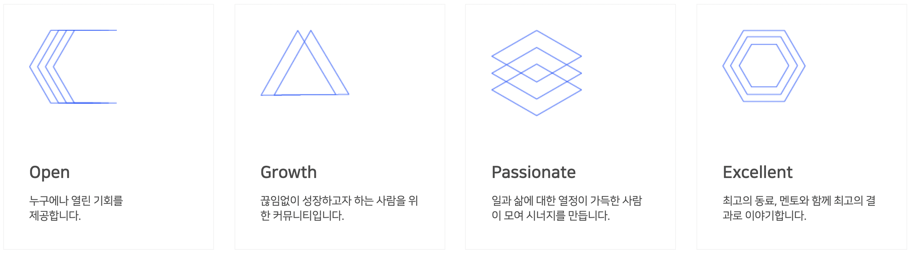
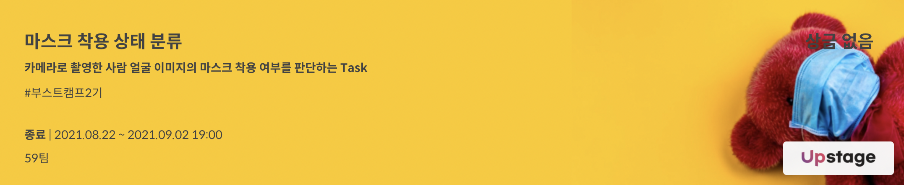
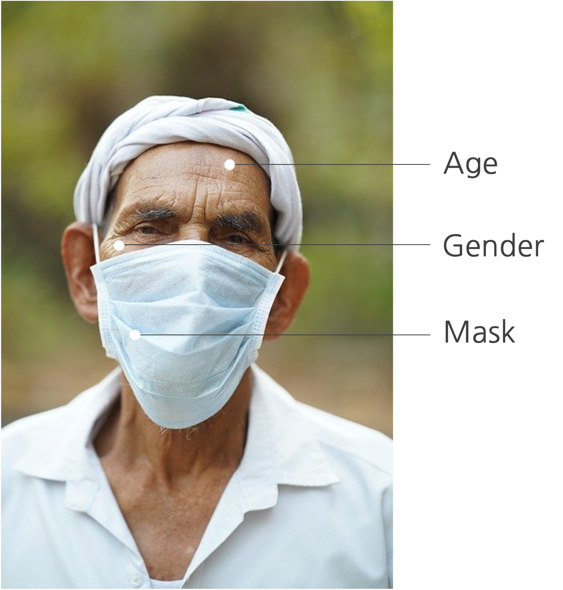
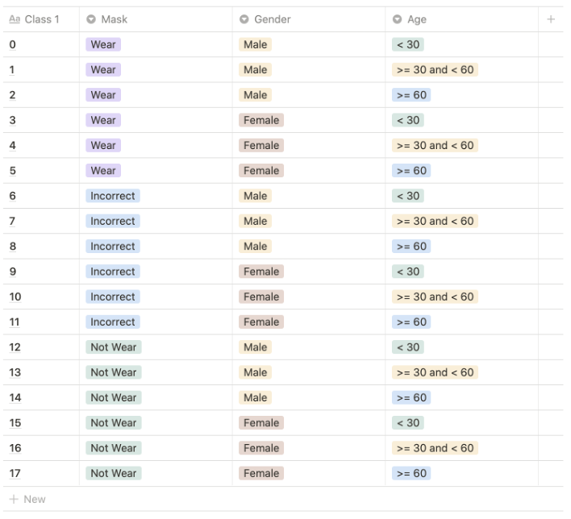
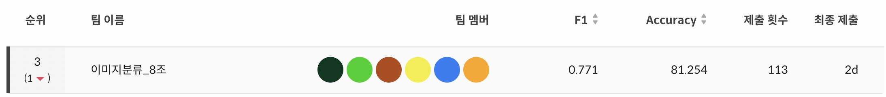

 

# Introduction  
  
NAVER Boostcamp AI Tech 2기  
 

## 🎨 AI pallete  
”색칠을 하다 보면 그림이 완성되어 있을 거예요”  
### 1. Members  

김지수|김혜수|배지연|이승현|임문경|진명훈
:-:|:-:|:-:|:-:|:-:|:-:
![image1][image1]|![image2][image2]|![image3][image3]|![image4][image4]|![image5][image5]|![image6][image6]
[Github](https://github.com/memesoo99)|[Github](https://github.com/vgptnv)|[Github](https://github.com/jiiyeon)|[Github](https://github.com/lsh3163)|[Github](https://github.com/larcane97)|[Github](https://github.com/jinmang2)

### 2. Contribution  
`김지수` &nbsp; Modeling • Feature Engineering • Age-specific model • EfficientNet Master • Out of fold  
`김혜수` &nbsp; Dataset curation • Construct Pipeline • Mental Care • Data license verification  
`배지연` &nbsp; Dataset generation • Dataset curation • Mask synthesis • Hyperparameter tuning  
`이승현` &nbsp; Team Management • Dataset preprocessing • Modeling • Make task-specific loss  
`임문경` &nbsp; EDA, Modeling • Visualizing • Search augmentation technique • MLops  
`진명훈` &nbsp; Modeling • Active Learning • Mentoring • Huggingface pipeline • Handling imbalance problem  

[image1]: ./_img/김지수.jpg
[image2]: ./_img/김혜수.png
[image3]: ./_img/배지연.jpg
[image4]: ./_img/이승현.png
[image5]: ./_img/임문경.png
[image6]: ./_img/진명훈.jpg

 

# Outline  

   
   

- **Task** : Image Classification
- **Date** : 2021.08.22 - 2021.09.02 [2 weeks]
- **Description** : 사람의 정면 사진을 입력받아서 `마스크 착용여부`, `성별`, `나이`를 추측하여 `18개의 class`로 분류함  
 

### 🏆 Final Score  

   

 

# Process

 

## Reference
